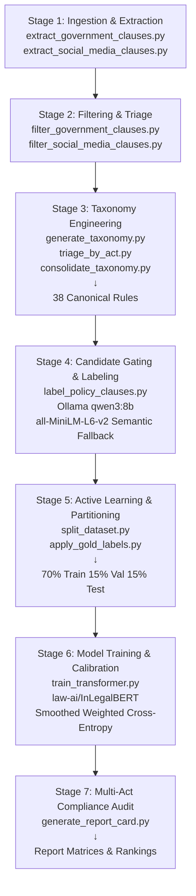

# Social Media Privacy Policy Compliance Auditor
## India Data Governance Framework

A comprehensive legal NLP and compliance auditing system that evaluates social media privacy policies against three major Indian statutory frameworks: the Digital Personal Data Protection Act 2023, Digital Personal Data Protection Rules 2025, and the Information Technology Act 2000.

## Project Overview

This system automatically extracts, classifies, and audits social media privacy policy clauses against a curated 38-rule statutory taxonomy. Using a multi-stage pipeline combining local LLM inference, transformer classification, and active learning, it produces defensible compliance scorecards for platforms audited: **WhatsApp, Meta, Telegram, Snapchat, YouTube, and Google**.

### Statutory Frameworks Audited

* **Digital Personal Data Protection Act, 2023 (DPDP Act 2023)** — 16 canonical consumer-facing rules covering data subject rights, consent management, breach notification, and cross-border transfers.
* **Digital Personal Data Protection Rules, 2025 (DPDP Rules 2025)** — 15 rules governing Data Fiduciary obligations, data retention, security safeguards, and Data Protection Impact Assessments.
* **Information Technology Act, 2000 & Intermediary Guidelines (IT Act 2000)** — 7 rules covering intermediary due diligence, safe-harbor requirements, and procedural safeguards.

### Target Platforms

Six major social media platforms evaluated across 771 policy clauses:

| Platform | Clauses Audited | Governance Clauses |
|----------|:---:|:---:|
| WhatsApp | 260 | 32 |
| Telegram | 124 | 16 |
| Snapchat | 109 | 16 |
| YouTube | 54 | 26 |
| Google | 98 | 12 |
| Meta | 126 | 4 |
| **Total** | **771** | **106** |

---

## Architecture & Pipeline

The compliance engine operates through seven integrated stages:



### Stage-by-Stage Breakdown

**Stage 1: Ingestion & Extraction**  
Extracts raw statutory PDFs and social media terms of service into structured clause tables using `pypdf`, `pdfplumber`, and OCR fallback (`pytesseract`).

**Stage 2: Filtering & Triage**  
Applies non-destructive regex heuristics and keyword-based filtering to identify candidate clauses for legal analysis, preserving recall-first methodology.

**Stage 3: Taxonomy Engineering**  
Synthesizes a canonical 38-rule statutory taxonomy from raw government acts via:
- LLM extraction (Ollama `qwen3:8b`)
- Semantic similarity clustering (cosine threshold = 0.85)
- Act-level triage and deduplication
- Final consolidation capturing assessability scores and checkable tests

**Stage 4: Candidate Gating & Labeling**  
Applies dynamic routing to social media clauses:
1. Category keyword matching across 10 regulatory categories
2. Child-safety regulatory context gating (requiring compound token context)
3. Per-category candidate cap (max 2 rules per category)
4. Semantic embedding fallback using pre-cached `all-MiniLM-L6-v2` vectors
5. Strict JSON classification with Pydantic enforcement

**Stage 5: Active Learning & Partitioning**  
Stratifies 771 clauses into balanced train/val/test splits, applies human-in-the-loop gold label promotion.

**Stage 6: Model Training & Calibration**  
Fine-tunes `law-ai/InLegalBERT` with:
- 3-class classification (Not Addressed / Partially Compliant / Compliant)
- Hyperparameters: LR = 1.5e-5 · Epochs = 5 · Batch = 8 · MaxLen = 384
- Loss: Smoothed Weighted Cross-Entropy (W_c = N_total / (K * N_c))
- Validation-calibrated threshold optimization on minority classes

**Stage 7: Multi-Act Compliance Audit**  
Computes platform compliance scorecards across five metrics with macro-averaging to preserve statutory co-equal force.

---

## Repository Structure

```
MajorProject/
├── corpus/
│   ├── dpdp_taxonomy_final.csv           # 38 canonical rules with assessability scores
│   ├── dpdp_taxonomy_final.json          # Taxonomy with checkable tests and keywords
│   ├── labeled_clauses_bootstrap.csv     # 771 annotated policy clauses (LLM labels)
│   ├── labeled_clauses_gold.csv          # Audited gold standard subset
│   ├── labeled_clauses_final_train.csv   # Training set (540 rows, 70%)
│   ├── labeled_clauses_val.csv           # Validation set (115 rows, 15%)
│   ├── candidates_for_compliance.csv     # Audit review queue
│   ├── label_cache/                      # SHA-256 keyed per-clause cache (2614 files)
│   └── taxonomy_generation/              # Intermediate taxonomy synthesis artifacts
│
├── datasets/
│   ├── GovernmentActs/
│   │   ├── source/                       # Raw statutory PDFs
│   │   ├── government_clauses.csv        # Extracted statutory clauses
│   │   ├── government_clauses_filtered.csv
│   │   └── government_clauses_cleaned.csv
│   ├── SocialMediaPolicies/
│   │   ├── source/                       # Privacy policy documents
│   │   ├── social_media_clauses.csv      # Extracted platform clauses
│   │   ├── social_media_clauses_flagged.csv
│   │   └── social_media_clauses_for_labeling.csv
│   └── splits/
│       ├── train.csv                     # 540-row training split
│       ├── val.csv                       # 115-row validation split
│       └── test.csv                      # 116-row test split
│
├── models/
│   ├── baseline/
│   │   ├── baseline_model.joblib         # Baseline classifier checkpoint
│   │   ├── eval_validation.json          # Epoch-by-epoch validation metrics
│   │   └── eval_test.json                # Uncalibrated test metrics
│   └── inlegalbert_classifier/
│       ├── config.json                   # Model configuration
│       ├── pytorch_model.bin              # Fine-tuned weights
│       ├── tokenizer.json                 # Tokenizer config
│       └── eval_calibrated_test_report.json  # Calibrated test results
│
├── reports/
│   ├── platform_overall_rankings.csv     # Platform compliance rankings
│   ├── platform_act_compliance_matrix.csv # Act-by-act scores
│   ├── category_gap_analysis.csv         # Regulatory category coverage gaps
│   └── audit_report_summary.json         # Machine-readable audit summary
│
├── src/
│   ├── extraction/
│   │   ├── extract_government_clauses.py
│   │   └── extract_social_media_clauses.py
│   ├── filtering/
│   │   ├── filter_government_clauses.py
│   │   └── filter_social_media_clauses.py
│   ├── taxonomy/
│   │   ├── generate_taxonomy.py
│   │   ├── triage_by_act.py
│   │   └── consolidate_taxonomy.py
│   ├── labeling/
│   │   └── label_policy_clauses.py
│   ├── training/
│   │   ├── split_dataset.py
│   │   ├── train_transformer.py
│   │   ├── apply_gold_labels.py
│   │   └── active_learning_review.py
│   └── evaluation/
│       ├── generate_report_card.py
│       └── evaluate_transformer_calibrated.py
│
├── PROJECT_REPORT.md                    # Comprehensive technical documentation
├── README.md                            # This file
└── .gitignore

```

---

## Taxonomy & Corpus Specifications

### Statutory Taxonomy: 38 Canonical Rules

| Framework | Rules | Consumer-Facing | Assessability |
|:---|:---:|:---:|:---:|
| DPDP Act 2023 | 16 | 13 (3 excluded: board sanction procedures) | Score 1–2 |
| DPDP Rules 2025 | 15 | 15 | Score 1–2 |
| IT Act 2000 | 7 | 7 | Score 1–2 |
| **Total** | **38** | **35** | — |

**Dual Denominator Rationale:**

- **Strict Coverage % Denominator = 38**: Measures coverage against the complete statutory universe.
- **Applicable Scope % Denominator = 35**: Adjusts for 3 DPDP Act rules (`DPDP_ACT-0121`, `DPDP_ACT-0123`, `DPDP_ACT-0153`) governing internal Data Protection Board sanction procedures. These rules legally cannot appear in consumer-facing privacy policies, so inclusion would artificially impose a 60.5% scoring ceiling. The adjustment preserves fair evaluation of consumer terms.

### Curated Clause Dataset: 771 Audited Clauses

Platform distribution reflects policy document size and complexity:

- **WhatsApp**: 260 clauses (33.7%)
- **Telegram**: 124 clauses (16.1%)
- **Snapchat**: 109 clauses (14.1%)
- **YouTube**: 54 clauses (7.0%)
- **Google**: 98 clauses (12.7%)
- **Meta**: 126 clauses (16.3%)

All clauses labeled with `qwen3:8b` (policy-labeling-v11-debiased-semantic), stratified into 70% train / 15% val / 15% test, with 106 governance clauses receiving human-in-the-loop gold audits.

---

## Scoring Methodology

The compliance engine employs a multi-criteria decision analysis (MCDA) framework with five quantitative metrics:

### 1. Strict Coverage %

Measures breadth against the complete statutory universe.

```
Strict Coverage % = (Unique Rules Covered / 38) * 100
```

**Ceiling: 60.5%** — Limited by 15 rules that have never been matched in practice across all 771 clauses.

### 2. Applicable Scope %

Measures breadth against consumer-facing mandates only.

```
Applicable Scope % = (Unique Rules Covered / 35) * 100
```

Excludes the 3 unapplicable board sanction rules, yielding a theoretical maximum of ~100%.

### 3. Clause Quality %

Measures depth and implementation rigor of matched clauses through ordinal verdict weighting.

```
Clause Quality % = (Sum of Verdict Weights / Count of Positive Clauses) * 100
```

**Verdict Weights:**
- **1.0** = Compliant (actionable, timeline-bound commitments)
- **0.5** = Partially Compliant (vague, non-enforceable commitments)
- **0.0** = Not Addressed / Non-Compliant (statutory gap, rights waiver)

### 4. Effective Compliance %

Blends breadth and depth via 50/50 MCDA weighting to ensure high scores require both statutory coverage and implementation rigor.

```
Effective Compliance % = (0.5 * Clause Quality %) + (0.5 * Applicable Scope %)
```

### 5. Combined Final %

Macro-averages compliance across all three statutory frameworks to preserve co-equal statutory force.

```
Combined Final % = (DPDP Act % + DPDP Rules % + IT Act %) / 3
```

**Legal Justification:** Under Indian jurisprudence, compliance is cumulative. High DPDP compliance (31 rules) cannot legally compensate for failing IT Act safe-harbor due diligence (7 rules). Equal weighting preserves the statutory hierarchy and enforceability.

---

## Empirical Audit Results

### Platform Overall Rankings

| Platform | Audited Clauses | Governance Clauses | Unique Rules | Compliant | Partial | Clause Quality % | Applicable Scope % | Combined Final % | Effective Compliance % | Warnings |
|:---|:---:|:---:|:---:|:---:|:---:|:---:|:---:|:---:|:---:|:---|
| **WhatsApp** | 260 | 32 | 19 | 10 | 22 | 65.6% | 54.3% | **29.4%** | 60.0% | — |
| **Telegram** | 124 | 16 | 10 | 9 | 7 | 78.1% | 28.6% | **21.0%** | 53.3% | — |
| **Snapchat** | 109 | 16 | 9 | 4 | 12 | 62.5% | 25.7% | **11.9%** | 44.1% | 38% of positives: DPDP_RUL-0227 |
| **YouTube** | 54 | 26 | 5 | 9 | 17 | 67.3% | 14.3% | **7.8%** | 40.8% | 81% of positives: DPDP_RUL-0227 |
| **Google** | 98 | 12 | 9 | 0 | 12 | 50.0% | 25.7% | **11.0%** | 37.9% | — |
| **Meta** | 126 | 4 | 3 | 1 | 3 | 62.5% | 8.6% | **6.9%** | 35.5% | 50% of positives: IT_ACT_2-0290 |

**Key Findings:**

- **WhatsApp leads compliance** with 29.4% Combined Final %, achieving 19/35 applicable rules (54.3% scope).
- **Telegram shows strong clause quality** (78.1%) but limited rule breadth (28.6% scope).
- **YouTube and Snapchat** exhibit high concentration risk: 81% and 38% of compliance respectively tied to a single rule (DPDP_RUL-0227, child protection).
- **Meta shows minimal compliance** (6.9% Combined Final %) with only 3 unique rules addressed and 4 governance clauses analyzed.
- **Google addresses 9 rules** but provides no fully compliant commitments (0 Compliant, all 12 are Partially Compliant).

### Act-by-Act Compliance Matrix

| Platform | DPDP Act 2023 % | DPDP Rules 2025 % | IT Act 2000 % | Combined Final % |
|:---|:---:|:---:|:---:|:---:|
| **WhatsApp** | 31.2% | 50.0% | 7.1% | **29.4%** |
| **Telegram** | 18.8% | 30.0% | 14.3% | **21.0%** |
| **Snapchat** | 15.6% | 20.0% | 0.0% | **11.9%** |
| **YouTube** | 3.1% | 13.3% | 7.1% | **7.8%** |
| **Google** | 12.5% | 13.3% | 7.1% | **11.0%** |
| **Meta** | 3.1% | 3.3% | 14.3% | **6.9%** |

**Statutory Observations:**

- **DPDP Rules 2025 drives highest compliance**: WhatsApp (50.0%), Telegram (30.0%), Snapchat (20.0%).
- **IT Act 2000 compliance is weakest** across all platforms (0–14.3%), indicating poor intermediary safe-harbor documentation.
- **Act-level imbalance**: No platform maintains balanced compliance across all three frameworks. Macro-averaging reveals asymmetric statutory coverage.

### Regulatory Category Gap Analysis

| Category | Clauses Identified | Platforms Addressing | Avg Quality | Platforms Missing |
|:---|:---:|:---:|:---:|:---:|
| Children/Vulnerable Groups | 37 | 5/6 | 71.6% | 1 |
| Data Retention & Erasure | 22 | 5/6 | 63.6% | 1 |
| Security Safeguards | 17 | 3/6 | 64.7% | 3 |
| Data Principal Rights | 10 | 5/6 | 65.0% | 1 |
| Consent & Notice | 8 | 4/6 | 56.2% | 2 |
| Intermediary/Platform Liability | 6 | 4/6 | 58.3% | 2 |
| Cross-Border Transfer | 4 | 2/6 | 50.0% | 4 |
| Breach Notification | 1 | 1/6 | 100.0% | 5 |
| Significant Data Fiduciary Obligations | 1 | 1/6 | 50.0% | 5 |

**Key Gaps:**

- **Breach Notification (1 clause)**: Only WhatsApp addresses this critical statutory requirement. 5 platforms entirely silent.
- **Cross-Border Transfer (4 clauses)**: Only Google and WhatsApp address data residency. Meta, Telegram, Snapchat, YouTube omit cross-border safeguards.
- **Security Safeguards (17 clauses)**: Only 3 platforms (WhatsApp, Google, Meta) address encryption, authentication, and access controls.

---

## Execution Guide

### Prerequisites

- **Python 3.9+**
- **Ollama runtime** with `qwen3:8b` model (`ollama pull qwen2:8b`)
- **PyTorch** (CPU or CUDA)
- **Dependencies**: `pypdf`, `pdfplumber`, `pytesseract`, `transformers`, `scikit-learn`, `pandas`, `numpy`

### Quick Start: Full Pipeline

```bash
# 1. Extraction & Filtering
python -m src.extraction.extract_government_clauses
python -m src.extraction.extract_social_media_clauses
python -m src.filtering.filter_government_clauses
python -m src.filtering.filter_social_media_clauses

# 2. Taxonomy Synthesis
python -m src.taxonomy.generate_taxonomy
python -m src.taxonomy.triage_by_act
python -m src.taxonomy.consolidate_taxonomy

# 3. Dynamic Gating & Labeling (with Ollama qwen3:8b)
python -m src.labeling.label_policy_clauses --force-new-run

# Optional: Targeted re-labeling
python -m src.labeling.label_policy_clauses --platform Meta,Youtube,Telegram --force-new-run

# 4. Training & Calibration
python -m src.training.split_dataset
python -m src.training.apply_gold_labels
python -m src.training.train_transformer
python -m src.evaluation.evaluate_transformer_calibrated

# 5. Statutory Report Card Generation
python -m src.evaluation.generate_report_card
```

### Output Artifacts

| File | Description |
|:---|:---|
| `reports/platform_overall_rankings.csv` | Platform compliance rankings with all 5 metrics |
| `reports/platform_act_compliance_matrix.csv` | Act-by-act scores and Combined Final % |
| `reports/category_gap_analysis.csv` | Regulatory category coverage and quality gaps |
| `reports/audit_report_summary.json` | Machine-readable audit metadata and findings |
| `corpus/labeled_clauses_gold.csv` | Human-audited gold standard subset |
| `models/inlegalbert_classifier/` | Fine-tuned transformer checkpoint |

---

## Known Limitations & Recommended Remediation

| Severity | Issue | Affected Files | Recommended Fix |
|:---|:---|:---|:---|
| **P0** | 15/38 taxonomy rules never matched; artificial 60.5% Strict Coverage ceiling | `generate_report_card.py` | Expand keyword maps in v12; document uncheckable rules formally |
| **P0** | DPDP_RUL-0227 (child protection) accounts for 32.9%–81% of positive labels across platforms | `labeled_clauses_bootstrap.csv` | Re-label with refined child-keyword gating; audit for false positives |
| **P1** | All train/val/test splits derive from single `qwen3:8b` labeling run | `split_dataset.py` | Independently re-label 30–50 val clauses with second annotator or model |
| **P1** | `Non-Compliant` class (1 sample) silently dropped by augmentation | `augment_minority.py` | Add to TARGET_COUNTS or formally exclude with documentation |
| **P1** | Random oversampling repeats 25 Compliant clauses ~6x per epoch | `augment_minority.py` | Replace with paraphrase augmentation or EDA |
| **P2** | 1,977 unmapped clauses lack documented exclusion rationale | `corpus/taxonomy_generation/` | Add README documenting unmapping criteria |
| **P2** | Hardcoded relative paths — silent failure from wrong CWD | `generate_report_card.py` | Migrate to argparse with absolute path resolution |

---

## Technical Specifications

### Model Configuration

- **Base Transformer**: `law-ai/InLegalBERT` (legal-domain BERT)
- **Task**: 3-class sequence classification (Not Addressed / Partially Compliant / Compliant)
- **Max Sequence Length**: 384 tokens
- **Batch Size**: 8
- **Learning Rate**: 1.5e-5
- **Epochs**: 5
- **Loss Function**: Smoothed Weighted Cross-Entropy (W_c = N_total / (K * N_c))
- **Semantic Embeddings**: `all-MiniLM-L6-v2` (cached vectors for 38 taxonomy rules)

### LLM Labeling Configuration

- **Model**: Ollama `qwen3:8b`
- **Temperature**: 0.0 (deterministic)
- **Prompt Version**: `policy-labeling-v11-debiased-semantic`
- **Candidate Selection**: Top 6 rules via keyword matching + semantic embedding fallback
- **Batch Processing**: 327 checkpoint-enabled batches

### Dataset Composition

- **Total Clauses**: 771 (from 6 platforms)
- **Training Split**: 540 (70%) — stratified on verdict
- **Validation Split**: 115 (15%) — stratified on verdict
- **Test Split**: 116 (15%) — stratified on verdict
- **Gold-Standard Audits**: 106 clauses (human-in-the-loop promotion)

---

## Citation & Attribution

This project implements a compliance auditing methodology grounded in:

1. **Statutory Interpretation**: Digital Personal Data Protection Act, 2023; DPDP Rules, 2025; Information Technology Act, 2000.
2. **NLP Architecture**: Transformer-based legal domain classification using `law-ai/InLegalBERT` and local LLM inference.
3. **Evaluation Metrics**: Multi-criteria decision analysis (MCDA) with macro-averaging to preserve statutory co-equal force.

---

## Contact & License

**Project Status**: Research & Audit Framework  
**Last Updated**: September 2026  
**Repository**: [MajorProject]

For questions or contributions, consult the `PROJECT_REPORT.md` technical documentation.

---

*Report generated: 2026-09-25 | Pipeline Version: v11 (policy-labeling-v11-debiased-semantic)*
